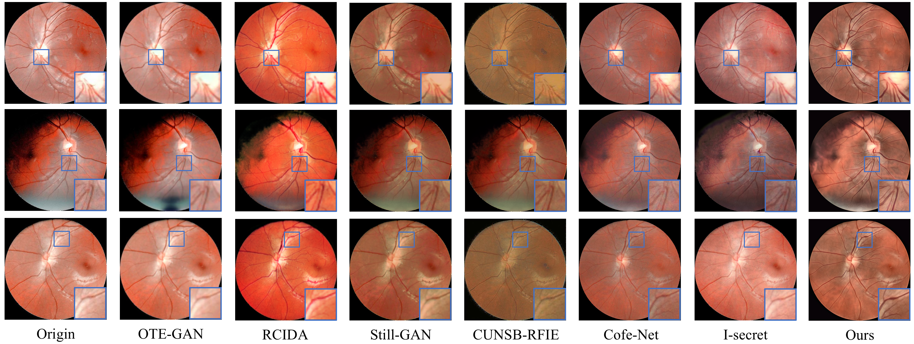

# Unified Framework for Enhancement of Low Quality Fundus Images

Lihua Ding, Chengyi Zhang, Xingzheng lyu(Mule), Shuchang Xu

Pytorch implementation of UFELQ.

## Paper

Unified Framework for Enhancement of Low Quality Fundus Images

<p align="center">
  
</p>

## Abstract

Compared to desktop fundus cameras, handheld ones offer portability and
affordability, although they often produce lower-quality images. This paper
primarily addresses the issue of reduced image quality commonly associated
with images captured by handheld fundus cameras. We first collected 538
fundus images obtained from handheld devices to form a dataset called Mule.
A unified framework that consists of three main modules is then proposed
to enhance the quality of fundus images. The Light Balance Module is em-
ployed first to suppress overexposure and underexposure. This is followed
by the Super Resolution Module to enhance vascular details. Finally, the
Vessel Enhancement Module is applied to improve image contrast. And a
special preservation strategy is additionally applied to retain mocular fea-
tures in the final fundus image. Objective evaluations demonstrate that the
proposed framework yields the most promising results. Further experiments
also suggest that it improves accuracy in downstream tasks, such as vessel
segmentation, optic disc/optic cup detection, macula detection, and fundus
image quality assessment.

<p align="center">
  
</p>

## Installation

* Install Pytorch 1.13.0 and CUDA 11.7
* Clone this repo

```
git clone https://github.com/Alen880/UFELQ
cd VPRR
```

## Data Preparation

* Download the Mule dataset from https://data.mendeley.com/datasets/mhx64cfxsf/2, Synthetic Dataset which consists of the FIVES dataset and the DRIVE dataset from https://pan.baidu.com/s/1w91aYx0qN1OuH5KUMTn_1A (code:UFLQ)
* Put the data under `./datasets/`
* Make the architecture of the datasets directory as:
```bash
dataset
    ├──Synthetic Dataset
        ├── train
        │   └── HR
        │   └── LR
        │   └── meta_info
        ├── test
        │   └── HR
        │   └── LR
    ├──Mule
        ├── train
        │   └── HR
        │   └── LR
        │   └── meta_info
        ├── test
        │   └── HR
        │   └── LR
```
Here, you can use the [scripts/generate_meta_info.py](scripts/generate_meta_info.py) script to generate the txt file(meta_info). <br>


## Train

* Download [pretrained weight](https://pan.baidu.com/s/17e2RNRbFt0vCKIfwg1SRVA?pwd=5e8d)(code:5e8d) and put it under `./weights/`
* Modify [options/finetune_realesrgan_x4plus.yml](options/finetune_realesrgan_x4plus.yml) accordingly, especially the `datasets` part:

```yml
train:
    name: Synthetic Dataset
    type: RealESRGANDataset
    dataroot_gt: ../datasets/Synthetic Dataset  # modify to the root path of your folder
    meta_info: ../datasets/Synthetic Dataset/train/meta_info/meta_info_five.txt  # modify to your own generate meta info txt
    io_backend:
        type: disk
```

## Evaluate

* To get the imgs after BLM, you need to use the [BLM/test.py](BLM/test.py) script to generate result in '/rslt'
* The training result weight will be sloved in floder `./experiments/finetune_RealESRGANx4plus_400k ${TIME}$/`,here, /${TIME}$/ refers to the time the code is executed.
* You need to use the [realesrgan/train.py](realesrgan/train.py) script to generate imgs after SRM.
* Finally, use the [VEM/CLAHE.py](VEM/CLAHE.py) script to generate the results.


## Citation

If you find the code useful for your research, please cite our paper.

## Contact

If you have any questions, please contact dlh1964980767@163.com

## Acknowledgments

Our code architecture is inspired by [RealESGAN](https://arxiv.org/abs/2107.10833),[Cofe-Net](https://ieeexplore.ieee.org/document/9288835)
